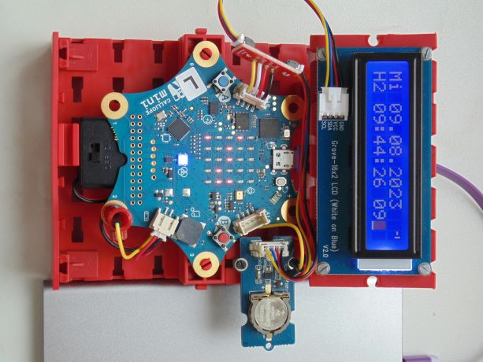

Diese Seite bei [https://calliope-net.github.io/i2c-uhr-stellen/](https://calliope-net.github.io/i2c-uhr-stellen/) öffnen.

### i2c Module an Calliope anstecken.

* [Grove - High Precision RTC (Real Time Clock)](https://wiki.seeedstudio.com/Grove_High_Precision_RTC/)
* [Grove - 16x2 LCD](https://wiki.seeedstudio.com/Grove-16x2_LCD_Series/)

Alle i2c Module werden parallel am linken Grove Steckverbinder A0 angeschlossen. 
Dazu kann ein [i2c-Hub](https://wiki.seeedstudio.com/Grove-I2C-Hub-6Port/) benutzt werden.
Für die Stromversorgung sollte Calliope über USB Kabel (an Computer oder Powerbank) angeschlossen sein.

#### .hex-Datei direkt auf Calliope laden, oder in MakeCode importieren.

* [mini-i2c-uhr-stellen.hex](mini-i2c-uhr-stellen.hex)
* [Schnappschuss (Bildschirmfoto mit den Blöcken)](mini-i2c-uhr-stellen.png)

#### Dieses Projekt von GitHub importieren, bearbeiten, mit Calliope testen.

Um dieses Repository in MakeCode zu importieren.

* öffne [https://makecode.calliope.cc](https://makecode.calliope.cc)
* klicke auf **Importieren** und dann auf **Importiere URL**
* kopiere die folgende **URL des Projekts** in die Zwischenablage (Strg-C)
* **calliope-net/i2c-uhr-stellen**
* füge sie auf der MakeCode Webseite ein (Strg-V) und klicke auf **Los geht's!**

### Bedienung der Calliope-App 'Uhr stellen'

Nur wenn ein LCD Modul mit RGB Hintergrundbeleuchtung angeschlossen ist, wird diese mit **A+B geklickt** an geschaltet.

* das Programm hat 3 Zustände (Variable iStatus):
  * *1 Anzeige Datum und Zeit* (RGB LED aus)
  * *2 Uhr stellen* (RGB LED blau)
  * *3 Register anzeigen und Offset stellen* (RGB LED gelb)
* die Umschaltung 1→2, 2→3 erfolgt mit **A+B halten**, zurück zu →1 mit **A+B geklickt**
* im Status *1 Anzeige Datum und Zeit*
  * **A geklickt** zeigt auf der 25 LED Matrix binär das Datum an (Variable i25LED = 1)
  * **B geklickt** zeigt auf der 25 LED Matrix binär die Zeit an (Variable i25LED = 2)
  * **A+B geklickt** RGB Hintergrundbeleuchtung grün, rot bei Fehler OscillatorStop
    * der Fehler wird gelöscht, wenn die Sekunde neu gestellt wird
  * **A+B halten** → Status-2
* im Status *2 Uhr stellen* (RGB LED blau)
  * Register: 0-Sekunde 1-Minute 2-Stunde 3-Tag 4-Wochentag 5-Monat 6-Jahr (Variable iReg)
  * am Anfang ist 2-Stunde eingestellt
  * **A geklickt** ändert den Wert im eingestellten Register um -1 (z.B. Stunde -1)
  * **B geklickt** ändert den Wert im eingestellten Register um +1 (z.B. Stunde +1)
  * **A halten** schaltet um auf ein anderes Register -1 (z.B. von 2-Stunde auf 1-Minute)
  * **B halten** schaltet um auf ein anderes Register +1 (z.B. von 2-Stunde auf 3-Tag)
  * **A+B geklickt** → Status-1
    * wenn Register 0-Sekunde eingestellt ist, wird die Sekunde auf 0 gestellt
  * **A+B halten**   → Status-3
* im Status *3 Register anzeigen und Offset stellen* (RGB LED gelb)
  * zeigt den Inhalt aller 4 Control-Register an, nur Offset kann geändert werden
  * **A geklickt** ändert den Wert im Offset Register um -1
  * **B geklickt** ändert den Wert im Offset Register um +1
    * Werte von -64 bis +63 dienen zur Korrektur, wenn die Uhr falsch geht
  * **A+B geklickt** → Status-1

Der Sekundentakt kann von einer **alle 1000 ms** Schleife kommen.
Genauer geht es, wenn ein PIN mit CLK am RTC-Modul verdrahtet wird.
Das wird erkennt und schaltet die Schleife ab (Variable bCLK). Ein Symbol wird im LCD Display angezeigt.

### Erweiterungen

Die Calliope-App 'Uhr stellen' lädt folgende Erweiterungen:

* [https://github.com/calliope-net/bit](https://calliope-net.github.io/bit/)
* [https://github.com/calliope-net/rtc-pcf85063tp](https://calliope-net.github.io/rtc-pcf85063tp/)
* [https://github.com/calliope-net/lcd-16x2rgb](https://calliope-net.github.io/lcd-16x2rgb/)

> [Upates für Erweiterungen; Erweiterungen aus einem Projekt löschen.](https://calliope-net.github.io/i2c-liste#updates)

> [Alle i2c-Erweiterungen für MakeCode von calliope-net (Software).](https://calliope-net.github.io/i2c-liste#erweiterungen)

#### Calliope-Apps, .hex-Dateien, Bildschirmfotos mit Blöcken

> [Alle Beispiel-Projekte für MakeCode von calliope-net (Calliope-Apps).](https://calliope-net.github.io/i2c-liste#programmierbeispiele)

> GitHub-Profil calliope-net: [https://github.com/calliope-net](https://github.com/calliope-net)

### Bezugsquellen

> [Alle i2c-Module und Bezugsquellen (Hardware).](https://calliope-net.github.io/i2c-liste#bezugsquellen)

#### Metadaten (verwendet für Suche, Rendering)

* Calliope mini
* i2c
